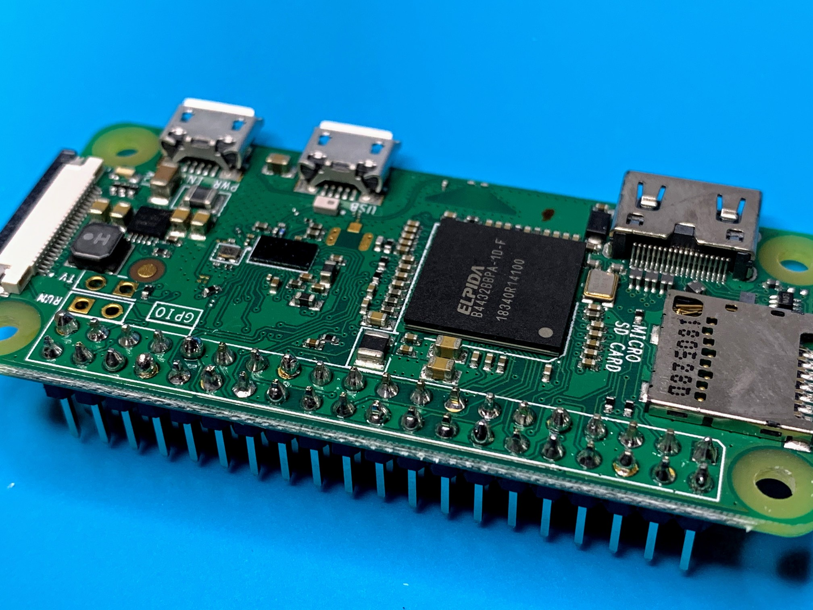

# Smart Aircon Controller

In this repo I will document my research and development of a smart Google Home-compatible aircon control device and share all and any sources I will write.

## R&D Log

<b>08 Jan 2021 / #0 / The Initial Commit</b>

Alright, first entry.

What I want to achieve by the end of the project.

**Plan MIN**: A device that can

- Turn the aircon on and off
- Be controlled through an API
- Be controlled through Google Home ("Hey Google turn on the aircon")

**Plan MAX**: A device that can do everything from plan MIN and also

- Set the desired settings on the aircon
- Detect room temperature and switch between aircon and fan
- Detect people in the room

I know that there are devices out there  that you can buy and that can do the whole conundrum. There are smart IR blasters, smart thermostats, etc. I even have some of those. However, this is an educational project for me, I never worked with electronics before. Also, this seems fun.

I'm going to focus on Mitsubishi Electric aircons because that's what I have currently but I'll try to make it easy to switch to another remote signal.

My initial vision of how this should work was: a Raspberry Pi Zero W with a small REST server with endpoints such as `/on` and `/off` that sends infrared (IR) signals through an IR LED, mimicking how a remote does it. Google Home then can just ping the endpoints - that is, if we somehow can teach it to.

After that came a bit of research with some interesting findings.

**AC Remote Infrared Codes**
First things first, I needed to make sure that my aircon is controlled by IR signals and not something else. IR is invisible to human eye so just looking down the remote wouldn't tell us much. I could have looked it up on the internet but that's boring too, so I remembered that webcams are often sensitive to IR, so I blasted it in my webcam and lo and behold it was blinking:

After that the whole project seemed easy. I quickly ordered these two components, an IR diode (left) and an IR receiver (right):

The plan was crystal clear: record the "on", "off", "temperature up", "temperature down" signals from the IR remote using the receiver and then just replay them using the diode when necessary.

After talking to a friend who meddled with controlling aircons before, I learned an awful truth about aircons and their remotes: they don't use the "on", "temperature up", "temperature down" signals at all. Instead, when you press the power button on your remote to turn the AC on, the remote sends the full settings matrix for the current settings that you see on you remote. So if you have on your remote the settings for "20 degrees, cooling mode, fan power 2, vane fully up", that's what the remote will send to the AC unit when you turn it on. If afterwards you press "temperature up" on your remote, instead of sending a "temperature up" code, it will send "**_21_** degrees, cooling mode, fan power 2, vane fully up" code. They do have the "off" signal though.

This makes the idea to record the signals from the remote much less attractive, as the signals afterwards could only be used to switch the aircon to a fixed predetermined setting.

It is still possible to try and decode the signals with some analysis. After a brief search I managed to find a repo where this was already done for Mitsubishi aircons, so for now I will probably rely on that: https://github.com/r45635/HVAC-IR-Control

**Connecting a Device to Google Home**
Another avenue of exploration was on how to connect the device to Google Home and make it work with the Assistant. After reading the docs I found out that since recently Google Home can do something that's called [Local Fulfilment](https://developers.google.com/assistant/smarthome/concepts/local) that enables the Assistant to work with devices on LAN directly through a REST API.

Unfortunately as it turns out you still have to create some kind of a Google Action (I haven't looked into this yet) in the online developer panel and setup a cloud fulfilment for that action as a fallback if LAN fulfilment doesn't work. To me it seems weird that you have to have a cloud fulfilment path and there is no way to have pure local devices; seems like a lot of potential customers with security requirements (organizations) are simply locked out of Google Home infra because of that.

**Detecting Presence**
I didn't do a lot of research on this topic but I found that you can buy passive infrared sensors for about a dollar a piece and they can output a signal if there is someone in their range.

I haven't done any further research in this direction so far.

**Other Stuff**
My Raspberry Pi Zero W turned out to be missing GPIO pins head, so I had to solder them on. This was the fourth time I was holding a soldering iron in my hands, so it was quite stressful.

After soldering 40 tiny junctions however, I feel much more confident in my skills. After visual inspection it seems that all junctions are properly soldered but time will tell.

Some junctions are just fine, others are a not so good (bottom right on the image below). Hopefully they will all work out.

That's all for now, signing off.

